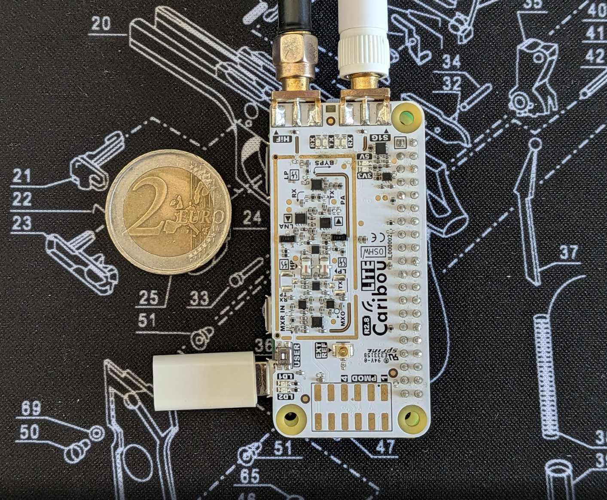
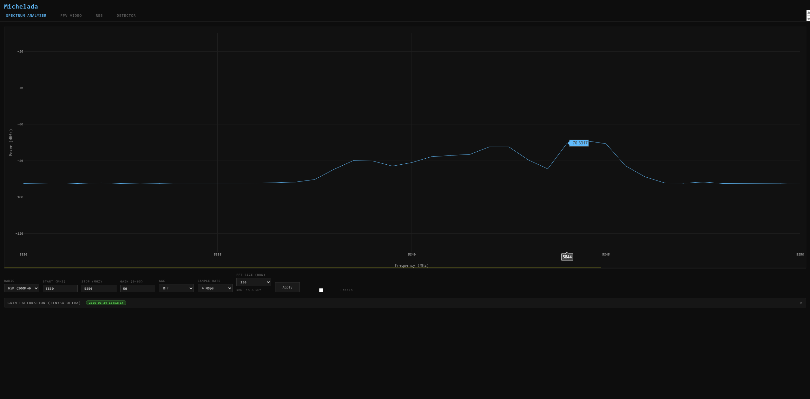
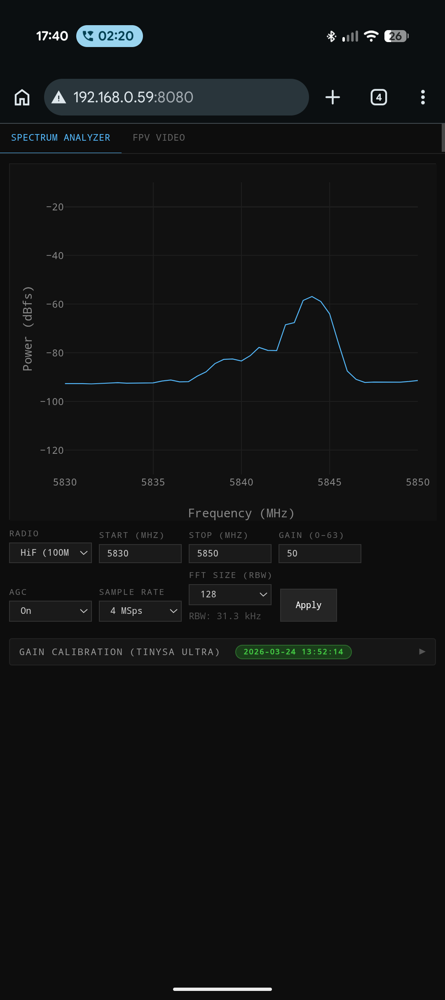
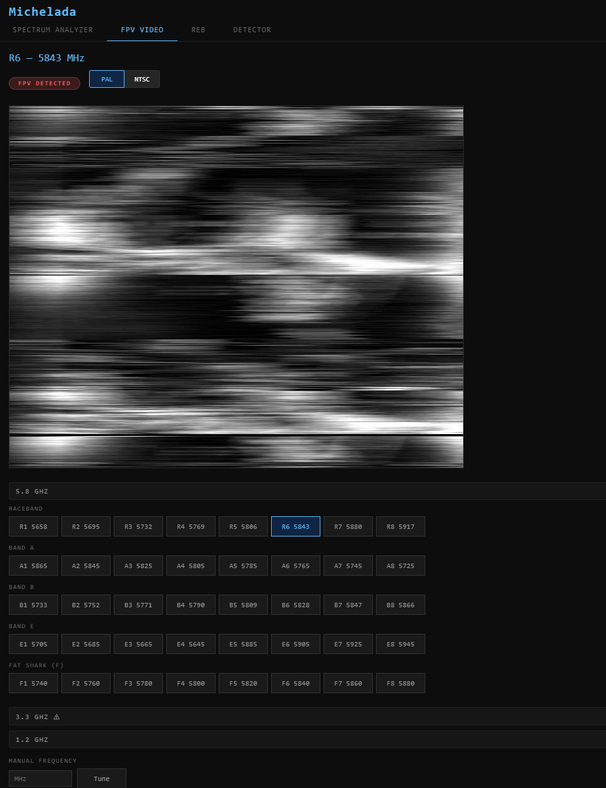
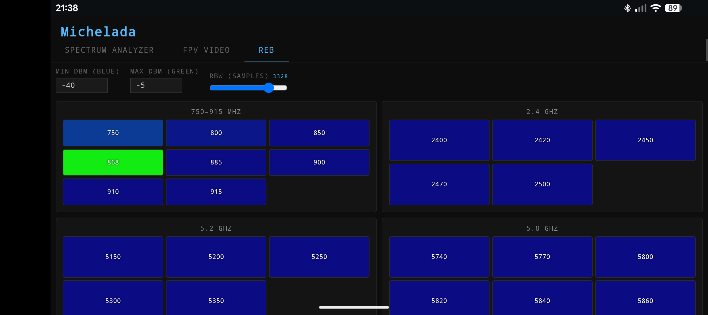
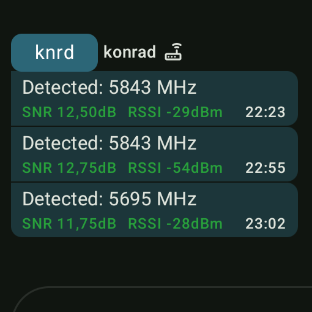

# Michelada - Electronic Warfare tool

Use your CaribouLite SDR as a field-portable spectrum analyzer, FPV drone detector, REB (jamming/spoofing devices) checker and more.

**Look how damn tiny it is!**



## Features

- Uses the CaribouLite SDR radios to scan 100 Mhz - 6 GHz
- Spectrum analyzer with RBW control, labels
- FPV drone detector using pseudo-complete FM demodulation with PAL/NTSC, as well as color subcarrier embedded in the video signal detection, it also filters out jamming and other RF noise to only detect the video signal, and show an alert on the browser when an FPV drone feed is detected
- Check your REB effectiveness with easy to understand UI
- Runs on the Pi, just install and have `./michelada` run automatically on boot, then navigate to pi IP address in your browser: http://pi-ip-address:8080
- Can be used via USB EThernet using the Pi's USB port, or via WiFi if you provide a hotspot

## Limitations:

The cariboulite SDR is not a very powerful SDR. The max sample rate output is limited to 4 Msps, compared to 61 Msps for a better SDR such as the Pluto Plus or Ettus B120 Mini.

At 4 Msps, it's not possible to do fully FM demod against FPV video. 

So the FPV video analyzer is a bit of a hack, it's not perfect, but it's good enough to detect FPV drones at close range and check that yours is working fine and emitting proper FPV video signal.

Range will also be worse than a dedicated detector such as Whoover 2, Chuyka, Teneta Pro, Prorok, etc...

Those devices use dedicated ASICs such as RX5808 to fully decode the signal and get better reception.

The sub1Ghz antenna is limited to `389.5-510 MHz / 779-1020 MHz`. 

## Modes

1. Spectrum analyzer



Also works on mobile:



2. FPV video analyzer



3. REB checker



4. Detector

Runs standalone without a browser, set in michelada.json:

```json
{
  "detector_start_on_boot": true,
  "detector_bands": ["5_8", "1_2"],
  "detector_cooldown": 60
}
```

Can be extended with scripts to run when a drone is detected, set in michelada.json:

```json
{
  "scripts": {
    "on_video_detected": [
      "python3 /home/pi/samples/scripts/mesh_alert.py",
    ]
  }
}
```



## Config:

First before doing anything, you need to configure the device. This is done by editing the michelada.json file.

Location: `/home/pi/michelada.json`

Copy the michelada.sample.json to michelada.json, disable/enable the modes you want to use.

- `detector_start_on_boot`: Whether to start the detector on boot, this won't allow you to use the other modes.
- `detector_bands`: The bands to scan for drones, can be `5_8`, `1_2`, `3_3`.
- `detector_cooldown`: The cooldown time in seconds between detections.
- `default_spectrum_frequencies`: The default frequencies to scan for the spectrum analyzer, set in MHz.
- `scripts`: The scripts to run when a drone is detected in Detector mode, set in the `on_video_detected` array.

## Installation

First, setup your Raspberry Pi with a fresh install of Raspberry Pi OS Bookworm Lite.

Personally I use:

```
$ uname -a
Linux drone 6.12.47+rpt-rpi-v8 #1 SMP PREEMPT Debian 1:6.12.47-1+rpt1~bookworm (2025-09-16) aarch64 GNU/Linux
```

Install cariboulite SDK, drivers and stuff according to their instructions: https://github.com/cariboulabs/cariboulite

Feel free to follow Jeff Geerling's guide: https://www.jeffgeerling.com/blog/2025/cariboulite-sdr-hat-sdr-on-raspberry-pi/

because installing the cariboutlite sdk is as enjoyable as pulling your fingernails off.

Also helpful: https://hagensieker.com/2025/03/04/dummies-guide-for-cariboulite-sdr/

---

Now install Go 1.24:

```bash
GOVERSION="1.24.4"
wget "https://golang.org/dl/go${GOVERSION}.linux-arm64.tar.gz" -4
tar -C /usr/local -xvf "go${GOVERSION}.linux-arm64.tar.gz"
rm "go${GOVERSION}.linux-arm64.tar.gz"
```

Add Go to your PATH:

```bash
cat >> ~/.bashrc << 'EOF'
export GOPATH=$HOME/go
export PATH=/usr/local/go/bin:$PATH:$GOPATH/bin
EOF

source ~/.bashrc
```

Now clone the repository:

```bash
git clone https://github.com/konradit/michelada.git
cd michelada
```

And finally:

runner.sh will compile the software, it will take a lot of time, grab a michelada while you wait.
```bash
./runner.sh

ls michelada
```

Navigate to the IP address of your Pi in your browser: http://pi-ip-address:8080

## Calibration

Plug a SMA to SMA cable between the cariboulite and a tinySA Ultra's RF port.

Plug in a USB cable between the tinySA Ultra and the DATA USB port (closest to the HDMI port in PiZero2), make sure it appears under /dev/ttyXXX.

In the Spectrum Analyzer mode, click on the Gain Calibration tab, and click on the Run button. Make sure port is properly selected and it exist.

Set a range such as 100 MHz - 6 GHz, step 5 MHz. It might take a while to complete.

Capture is saved to `/root/.config/michelada/hif_cal.json`.

Without the the Spectrum Analyzer mode will use uncalibrated readings and won't be very effective.

## Using with a phone:

There are several ways to have a phone or tablet connected to the Pi and show the interface on the browser.

- **RPI USB Gadget**: https://github.com/raspberrypi/rpi-usb-gadget, works on Bookworm but requires installing the package. Needs to know the IP address on the Pi, on my phone hostname.local can't be resolved.
- Instructions from evilsocket's arc: https://www.evilsocket.net/2017/12/07/DIY-Portable-Secrets-Manager-with-a-RPI-Zero-and-the-ARC-Project/
- Using adb reverse proxy:

```bash
sudo apt install adb
adb reverse tcp:8080 tcp:8080
```

For easy installation, copy the bootservices/michelada.service and bootservices/adb-reverse-proxy.service to /etc/systemd/system/ and enable them:
```bash
sudo cp bootservices/michelada.service /etc/systemd/system/
sudo cp bootservices/adb-reverse-proxy.service /etc/systemd/system/
sudo systemctl enable michelada.service
sudo systemctl enable adb-reverse-proxy.service
sudo systemctl start michelada.service
sudo systemctl start adb-reverse-proxy.service
```

Then your phone or tablet needs to be connecte to the Pi's USB port (PI Zero2 is closest to the HDMI port) and then just navigate to localhost:8080 on a browser.

## Why the name?

[IYKYK](https://en.wikipedia.org/wiki/Shibboleth), it's a tasty drink, [try it.](https://www.chilipeppermadness.com/chili-pepper-recipes/drinks/michelada-recipe-traditional/)

## Shouts

- [Jeff Geerling](https://www.jeffgeerling.com/) for his guide on installing the cariboulite SDK
- d0tslash for general guidance